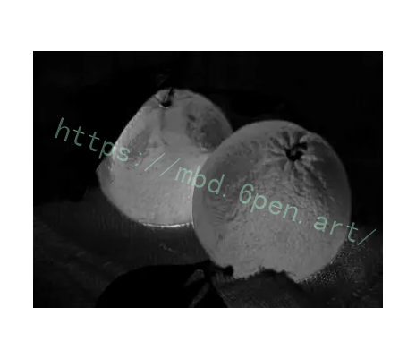

## 1.研究背景与意义


柑橘是一种重要的水果，具有丰富的营养价值和广泛的市场需求。在柑橘的种植和销售过程中，准确测量柑橘的颜色范围和尺寸是非常重要的。传统的柑橘颜色范围和尺寸测量方法通常需要人工操作，耗时耗力且容易出现误差。因此，开发一种基于OpenCV的柑橘颜色范围尺寸测量系统具有重要的研究意义和实际应用价值。

首先，柑橘的颜色范围是衡量柑橘成熟度和品质的重要指标之一。通过测量柑橘的颜色范围，可以准确判断柑橘的成熟度和品质，帮助种植者和销售商进行合理的采摘和分类，提高柑橘的市场竞争力。

其次，柑橘的尺寸是决定柑橘产量和市场价值的重要因素之一。传统的尺寸测量方法通常需要人工操作，容易出现误差，并且耗时耗力。而基于OpenCV的柑橘尺寸测量系统可以通过图像处理和计算机视觉技术，实现自动化的尺寸测量，提高测量的准确性和效率，减少人力成本。

此外，基于OpenCV的柑橘颜色范围尺寸测量系统还可以应用于柑橘的质量检测和分级。通过测量柑橘的颜色范围和尺寸，可以对柑橘进行自动分类和分级，提高柑橘的质量控制和市场竞争力。

最后，基于OpenCV的柑橘颜色范围尺寸测量系统还可以为柑橘种植和销售提供科学依据和技术支持。通过建立柑橘颜色范围和尺寸的数据库，可以为柑橘的种植和销售提供参考和指导，帮助种植者和销售商制定合理的种植和销售策略，提高柑橘的产量和市场竞争力。

综上所述，基于OpenCV的柑橘颜色范围尺寸测量系统具有重要的研究意义和实际应用价值。通过开发这一系统，可以实现柑橘颜色范围和尺寸的自动化测量，提高测量的准确性和效率，为柑橘的种植和销售提供科学依据和技术支持，促进柑橘产业的发展和提升。

# 2.图片演示


# 3.视频演示
[基于OpenCV的柑橘颜色范围尺寸测量系统_哔哩哔哩_bilibili](https://www.bilibili.com/video/BV1My4y1A7rU/?spm_id_from=333.999.0.0&vd_source=ff015de2d29cbe2a9cdbfa7064407a08)

# 4.颜色通道选择
首先尝试了不同颜色通道为例。


## 5.核心代码讲解

#### 5.1 color.py

封装为类后的代码如下：

```python

class ImageProcessing:
    def __init__(self):
        self.work_book = xlwt.Workbook()
        self.work_sheet = self.work_book.add_sheet('Test')

    def mosaic(self, img, p1, p2):
        im = img
        im2 = cv2.flip(im, 0, im)
        im2resize = cv2.resize(im2, (abs(p1[0] - p2[0]), abs(p1[1] - p2[1])))
        im[min(p1[1], p2[1]):max(p1[1], p2[1]), min(p1[0], p2[0]):max(p1[0], p2[0])] = im2resize
        return im

......
```
该程序文件名为color.py，主要功能如下：

1. 引入了cv2、numpy、random、PIL、os、xlwt等库。
2. 创建了一个名为work_book的工作簿。
3. 在工作簿中增加了一个名为Test的sheet表。
4. 定义了一系列函数，包括mosaic、mixup、cutout、enlarge_2x、enlarge_4x、affine、Perspective、batch、contours_in、findmax_box、draw_wh、caiyang、findmax_box2和sort_juzi。
5. batch函数用于对指定路径下的图片进行批量处理，包括mosaic、cutout、mixup、enlarge_2x、enlarge_4x、affine和Perspective等操作，并将处理后的图片保存到指定路径下。
6. contours_in函数用于获取轮廓内所有点的坐标。
7. findmax_box函数用于找到图像中最大的棕色区域，并在图像上绘制该区域的边框

#### 5.2 cutout.py

以下是将代码封装为类的核心部分：

```python

class Cutout:
    def __init__(self, image_path):
        self.image_path = image_path
        self.im = cv2.imread(image_path)

    def generate_mask(self):
        p1 = (random.randint(0, self.im.shape[1]), random.randint(0, self.im.shape[0]))
        p2 = (random.randint(0, self.im.shape[1]), random.randint(0, self.im.shape[0]))
        cv2.rectangle(self.im, (min(p1[0], p2[0]), min(p1[1], p2[1])), (max(p1[0], p2[0]), max(p1[1], p2[1])), [0, 0, 0], -1)

    def show_image(self):
        cv2.imshow('cutout', self.im)
        cv2.waitKey(0)

```

这个类名为`Cutout`，在初始化时传入图像路径。`generate_mask`方法生成随机的矩形区域，并在图像上绘制黑色的遮罩。`show_image`方法显示处理后的图像。最后，创建`Cutout`对象，调用`generate_mask`和`show_image`方法实现相同的功能。

这个程序文件名为cutout.py，它使用了OpenCV库来实现一个图像剪切的功能。首先，它读取了一个名为1.jpg的图像文件。然后，它随机生成了两个点p1和p2，这两个点用来确定一个矩形区域。接下来，程序使用这个矩形区域在图像上绘制了一个黑色的遮罩，将该区域内的像素值都设为0。最后，程序显示了处理后的图像，并等待用户按下任意键关闭窗口。

#### 5.3 cut_hsv_range.py

```python

class ImageProcessor:
    def __init__(self, image_path):
        self.image = cv2.imread(image_path)
        self.imagecopy = self.image.copy()
        self.list1 = []
        self.list2 = []
        self.num = 0

    def resize_image(self):
        self.image = cv2.resize(self.image, (0, 0), fx=0.3, fy=0.3, interpolation=cv2.INTER_NEAREST)

    def getpos(self, event, x, y, flags, param):
        HSV3 = self.HSV2.copy()
        if event == cv2.EVENT_MOUSEMOVE:
            self.HSV = HSV3
            cv2.line(self.HSV, (0, y), (self.HSV.shape[1] - 1, y), (255, 255, 255), 1, 4)
            cv2.line(self.HSV, (x, 0), (x, self.HSV.shape[0] - 1), (255, 255, 255), 1, 4)
            cv2.imshow("imageHSV", self.HSV)
        elif event == cv2.EVENT_LBUTTONDOWN:
            self.num += 1
            self.HSV = HSV3
            if self.num == 1:
                self.list1.append([x, y])
                print('请点击HSV图片上第二个点')
            if self.num == 2:
                self.num = 0
                self.list2.append([x, y])
                for i in range(min(self.list1[-1][0], self.list2[-1][0]), max(self.list1[-1][0], self.list2[-1][0])):
                    for j in range(min(self.list1[-1][1], self.list2[-1][1]), max(self.list1[-1][1], self.list2[-1][1])):
                        self.hlist.append(self.HSV[j, i][0])
                        self.slist.append(self.HSV[j, i][1])
                        self.vlist.append(self.HSV[j, i][2])
                self.hlist.sort()
                self.slist.sort()
                self.vlist.sort()
                print(self.hlist)
                print(self.slist)
                print(self.vlist)
                print('请点击HSV图片上第一个点')
                print((self.hlist[0], self.slist[0], self.vlist[0]), (self.hlist[-1], self.slist[-1], self.vlist[-1]))

    def process_image(self):
        self.resize_image()
        self.HSV = self.image.copy()
        self.HSV2 = self.image.copy()
        self.num = 0
        self.hlist = []
        self.slist = []
        self.vlist = []

        cv2.imshow("imageHSV", self.HSV)
        cv2.setMouseCallback("imageHSV", self.getpos)
        cv2.waitKey(0)
......
```

这个程序文件名为cut_hsv_range.py，它的功能是通过点击HSV图片来确定一个矩形范围，并输出该范围内的像素值的最小值和最大值。程序的主要步骤如下：

1. 导入所需的库：cv2、numpy和matplotlib.pyplot。
2. 读取一张图片（C2.JPG）并进行备份。
3. 定义一些变量和列表，用于存储点击的坐标和像素值。
4. 进入一个无限循环，直到按下键盘上的任意键退出。
5. 调整图片的尺寸为原来的0.3倍。
6. 复制图片的副本，用于绘制鼠标移动时的辅助线。
7. 定义一个鼠标事件的回调函数，用于处理鼠标移动和点击事件。
8. 在鼠标移动事件中，绘制水平和垂直辅助线，并在HSV图片上显示。
9. 在鼠标点击事件中，根据点击的次数，记录点击的坐标，并计算出矩形范围内的像素值。
10. 对像素值进行排序，并输出最小值和最大值。
11. 显示HSV图片，并设置鼠标事件的回调函数。
12. 等待按下键盘上的任意键。
13. 程序结束。

#### 5.4 data_enhance.py

```python

class ImageProcessing:
    def __init__(self, path, savepath):
        self.path = path
        self.savepath = savepath

    def process_images(self):
        if not os.path.exists(self.savepath):
            os.mkdir(self.savepath)
        list = os.listdir(self.path)
        for i in list:
            img = cv2.imread(self.path + '/' + i)
            imgcopy1 = img.copy()
            imgcopy2 = img.copy()
            imgcopy3 = img.copy()
            imgcopy4 = img.copy()
            imgcopy5 = img.copy()
            cv2.imwrite(self.savepath + '/' + 'original-' + i, img, [int(cv2.IMWRITE_JPEG_QUALITY), 100])
            res = cv2.resize(imgcopy1, None, fx=2, fy=2, interpolation=cv2.INTER_CUBIC)
            cv2.imwrite(self.savepath + '/' + '2x-' + i, res, [int(cv2.IMWRITE_JPEG_QUALITY), 100])
            res = cv2.resize(res, None, fx=2, fy=2, interpolation=cv2.INTER_CUBIC)
            cv2.imwrite(self.savepath + '/' + '4x-' + i, res, [int(cv2.IMWRITE_JPEG_QUALITY), 100])
            rows, cols, ch = img.shape
            M = np.float32([[1, 0, 100], [0, 1, 50]])
            dst = cv2.warpAffine(imgcopy2, M, (cols, rows))
            cv2.imwrite(self.savepath + '/' + 'move-' + i, dst, [int(cv2.IMWRITE_JPEG_QUALITY), 100])
            rows, cols, ch = img.shape
            M = cv2.getRotationMatrix2D(((cols - 1) / 2.0, (rows - 1) / 2.0), 90, 1)
            dst = cv2.warpAffine(imgcopy3, M, (cols, rows))
            cv2.imwrite(self.savepath + '/' + '90-' + i, dst, [int(cv2.IMWRITE_JPEG_QUALITY), 100])
            rows, cols, ch = img.shape
            pts1 = np.float32([[50, 50], [200, 50], [50, 200]])
            pts2 = np.float32([[10, 100], [200, 50], [100, 250]])
            M = cv2.getAffineTransform(pts1, pts2)
  ......
```

这个程序文件名为data_enhance.py，它使用了OpenCV库来对图像进行增强处理。程序的主要功能是将指定路径下的图像进行多种处理，并保存到指定的保存路径下。

程序的具体流程如下：
1. 导入所需的库：cv2、numpy和os。
2. 设置输入路径和保存路径。
3. 如果保存路径不存在，则创建保存路径。
4. 获取输入路径下的所有文件列表。
5. 遍历文件列表，对每个文件进行处理。
6. 使用cv2.imread函数读取图像。
7. 复制原始图像，创建5个副本。
8. 使用cv2.imwrite函数将原始图像保存到保存路径下，并命名为'original-' + 文件名。
9. 使用cv2.resize函数将图像副本进行2倍放大，并保存到保存路径下，并命名为'2x-' + 文件名。
10. 再次使用cv2.resize函数将上一步得到的图像进行2倍放大，并保存到保存路径下，并命名为'4x-' + 文件名。
11. 使用cv2.warpAffine函数对图像副本进行平移操作，并保存到保存路径下，并命名为'move-' + 文件名。
12. 使用cv2.getRotationMatrix2D函数对图像副本进行旋转操作（90度），并保存到保存路径下，并命名为'90-' + 文件名。
13. 使用cv2.getAffineTransform函数对图像副本进行仿射变换操作，并保存到保存路径下，并命名为'fang-' + 文件名。
14. 使用cv2.getPerspectiveTransform函数对图像副本进行透视变换操作，并保存到保存路径下，并命名为'tou-' + 文件名。

总之，这个程序通过对图像进行放大、平移、旋转、仿射变换和透视变换等操作，生成了多个增强后的图像，并保存到指定路径下。

#### 5.5 mixup.py

```python


class ImageBlender:
    def __init__(self, img1_path, img2_path):
        self.img1 = Image.open(img1_path).convert('RGBA')
        self.img2 = Image.open(img2_path).convert('RGBA')
        self.img2 = self.img2.resize(self.img1.size)
    
    def blend_images(self, alpha):
        return Image.blend(self.img1, self.img2, alpha)
    
    def save_blend_image(self, output_path, alpha):
        img = self.blend_images(alpha)
        img.save(output_path)
    
.......

```

这个程序文件名为mixup.py，它使用了PIL和cv2库。程序的功能是将两张图片进行混合处理，并保存混合后的图片。

程序首先导入了PIL库和cv2库。然后，它使用Image.open()函数打开了两张图片，分别命名为img1和img2，并将它们转换为RGBA模式。

接下来，程序使用img2.resize()函数将img2的尺寸调整为与img1相同的大小。

然后，程序使用Image.blend()函数将img1和img2按照0.5的权重进行混合处理，生成了混合后的图片img。

最后，程序使用img.show()函数显示混合后的图片，并使用img.save()函数将混合后的图片保存为blend.jpg文件。

#### 5.6 mosaic.py

```python

class ImageCutout:
    def __init__(self, image_path1, image_path2):
        self.im = cv2.imread(image_path1)
        self.im2 = cv2.imread(image_path2)
    
    def cutout(self):
        p1 = (random.randint(0, self.im.shape[1]), random.randint(0, self.im.shape[0]))
        p2 = (random.randint(0, self.im.shape[1]), random.randint(0, self.im.shape[0]))
        im2resize = cv2.resize(self.im2, (abs(p1[0] - p2[0]), abs(p1[1] - p2[1])))
        self.im[min(p1[1], p2[1]):max(p1[1], p2[1]), min(p1[0], p2[0]):max(p1[0], p2[0])] = im2resize
        cv2.imshow('cutout', self.im)
        cv2.waitKey(0)
.......
```

这个程序的文件名是mosaic.py，它的功能是将两张图片进行拼接。程序首先引入了cv2和random两个库。然后通过cv2.imread函数读取了两张图片，分别是1.jpg和2.jpg。接下来，程序随机生成了两个点p1和p2，这两个点的坐标在图像im的范围内。然后，程序对图像im2进行了比例变换，将其大小调整为p1和p2两个点之间的距离。最后，程序将im2resize的部分替换到im的对应位置上，并通过cv2.imshow函数展示结果。用户可以通过按下任意键来关闭展示窗口。

## 6.系统整体结构

整体功能和构架概括：
这个工程是一个基于OpenCV的柑橘颜色范围尺寸测量系统。它包含了多个程序文件，每个文件都有不同的功能，用于处理图像、测量柑橘颜色范围和尺寸等。

下面是每个文件的功能整理：

| 文件名                | 功能                                                         |
| --------------------- | ------------------------------------------------------------ |
| color.py              | 实现柑橘颜色范围的测量，包括对图像进行处理和找到最大的棕色区域等操作 |
| cutout.py             | 实现图像的剪切功能，通过鼠标点击确定矩形区域并将该区域内的像素值设为0 |
| cut_hsv_range.py      | 通过点击HSV图片确定矩形范围，并输出该范围内的像素值的最小值和最大值 |
| data_enhance.py       | 对图像进行增强处理，包括放大、平移、旋转、仿射变换和透视变换等操作 |
| mixup.py              | 将两张图片进行混合处理，生成混合后的图片                     |
| mosaic.py             | 将两张图片进行拼接                                           |

以上是对每个文件功能的简要概述，每个文件都有不同的功能，用于实现柑橘颜色范围的测量、图像处理和增强等操作。

# 7.二值化处理
由于图像主要分布在红色、绿色通道空间内，因此将归一化后的图像进行红绿分割，即灰度化处理。

思想于平常灰度化亮度值不同，将比较方式改为红色绿色通道内的值大小


# 8.形态学操作
对处理后的图像进行形态学操作。

填补小空洞：开运算

梗处理：膨胀

为了防止图像严重失真，核不宜过大，故先采用一次开操作将白色噪点填充，后逐渐降低膨胀的核大小，一连四次膨胀。


# 9.系统整合

下图[完整源码＆环境部署视频教程](https://s.xiaocichang.com/s/5984ca)


参考博客[《Python基于深度学习的区域人员计数系统（部署教程和源码）》](https://s.xiaocichang.com/s/5984ca)

# 10.参考文献
---
[1][雷欢](https://s.wanfangdata.com.cn/paper?q=%E4%BD%9C%E8%80%85:%22%E9%9B%B7%E6%AC%A2%22),[吴亮生](https://s.wanfangdata.com.cn/paper?q=%E4%BD%9C%E8%80%85:%22%E5%90%B4%E4%BA%AE%E7%94%9F%22),[焦泽昱](https://s.wanfangdata.com.cn/paper?q=%E4%BD%9C%E8%80%85:%22%E7%84%A6%E6%B3%BD%E6%98%B1%22),等.[果园环境中成熟杨梅自动检测方法研究](https://d.wanfangdata.com.cn/periodical/gdzdhyxxgc202103002)[J].[自动化与信息工程](https://sns.wanfangdata.com.cn/perio/gdzdhyxxgc).2021,(3).DOI:10.3969/j.issn.1674-2605.2021.03.002 .

[2][刘天真](https://s.wanfangdata.com.cn/paper?q=%E4%BD%9C%E8%80%85:%22%E5%88%98%E5%A4%A9%E7%9C%9F%22),[滕桂法](https://s.wanfangdata.com.cn/paper?q=%E4%BD%9C%E8%80%85:%22%E6%BB%95%E6%A1%82%E6%B3%95%22),[苑迎春](https://s.wanfangdata.com.cn/paper?q=%E4%BD%9C%E8%80%85:%22%E8%8B%91%E8%BF%8E%E6%98%A5%22),等.[基于改进YOLO v3的自然场景下冬枣果实识别方法](https://d.wanfangdata.com.cn/periodical/nyjxxb202105002)[J].[农业机械学报](https://sns.wanfangdata.com.cn/perio/nyjxxb).2021,(5).DOI:10.6041/j.issn.1000-1298.2021.05.002 .

[3][赵辉](https://s.wanfangdata.com.cn/paper?q=%E4%BD%9C%E8%80%85:%22%E8%B5%B5%E8%BE%89%22),[李浩](https://s.wanfangdata.com.cn/paper?q=%E4%BD%9C%E8%80%85:%22%E6%9D%8E%E6%B5%A9%22),[岳有军](https://s.wanfangdata.com.cn/paper?q=%E4%BD%9C%E8%80%85:%22%E5%B2%B3%E6%9C%89%E5%86%9B%22),等.[基于RGB-D相机的矮砧苹果识别与定位](https://d.wanfangdata.com.cn/periodical/jsjgcysj202008030)[J].[计算机工程与设计](https://sns.wanfangdata.com.cn/perio/jsjgcysj).2020,(8).DOI:10.16208/j.issn1000-7024.2020.08.030 .

[4][闫彬](https://s.wanfangdata.com.cn/paper?q=%E4%BD%9C%E8%80%85:%22%E9%97%AB%E5%BD%AC%22),[郭文川](https://s.wanfangdata.com.cn/paper?q=%E4%BD%9C%E8%80%85:%22%E9%83%AD%E6%96%87%E5%B7%9D%22).[基于K-means聚类与果萼形状的‘海沃德’猕猴桃膨大果检测方法](https://d.wanfangdata.com.cn/periodical/xbnydxxb202005018)[J].[西北农林科技大学学报（自然科学版）](https://sns.wanfangdata.com.cn/perio/xbnydxxb).2020,(5).DOI:10.13207/j.cnki.jnwafu.2020.05.018 .

[5][寇大磊](https://s.wanfangdata.com.cn/paper?q=%E4%BD%9C%E8%80%85:%22%E5%AF%87%E5%A4%A7%E7%A3%8A%22),[权冀川](https://s.wanfangdata.com.cn/paper?q=%E4%BD%9C%E8%80%85:%22%E6%9D%83%E5%86%80%E5%B7%9D%22),[张仲伟](https://s.wanfangdata.com.cn/paper?q=%E4%BD%9C%E8%80%85:%22%E5%BC%A0%E4%BB%B2%E4%BC%9F%22).[基于深度学习的目标检测框架进展研究](https://d.wanfangdata.com.cn/periodical/jsjgcyyy201911004)[J].[计算机工程与应用](https://sns.wanfangdata.com.cn/perio/jsjgcyyy).2019,(11).DOI:10.3778/j.issn.1002-8331.1902-0254 .

[6][金超杞](https://s.wanfangdata.com.cn/paper?q=%E4%BD%9C%E8%80%85:%22%E9%87%91%E8%B6%85%E6%9D%9E%22),[梁喜凤](https://s.wanfangdata.com.cn/paper?q=%E4%BD%9C%E8%80%85:%22%E6%A2%81%E5%96%9C%E5%87%A4%22),[章艳](https://s.wanfangdata.com.cn/paper?q=%E4%BD%9C%E8%80%85:%22%E7%AB%A0%E8%89%B3%22),等.[基于matlab的番茄果实串检测提取](https://d.wanfangdata.com.cn/periodical/jsnykx201808053)[J].[江苏农业科学](https://sns.wanfangdata.com.cn/perio/jsnykx).2018,(8).DOI:10.15889/j.issn.1002-1302.2018.08.053 .

[7][熊俊涛](https://s.wanfangdata.com.cn/paper?q=%E4%BD%9C%E8%80%85:%22%E7%86%8A%E4%BF%8A%E6%B6%9B%22),[刘振](https://s.wanfangdata.com.cn/paper?q=%E4%BD%9C%E8%80%85:%22%E5%88%98%E6%8C%AF%22),[汤林越](https://s.wanfangdata.com.cn/paper?q=%E4%BD%9C%E8%80%85:%22%E6%B1%A4%E6%9E%97%E8%B6%8A%22),等.[自然环境下绿色柑橘视觉检测技术研究](https://d.wanfangdata.com.cn/periodical/nyjxxb201804005)[J].[农业机械学报](https://sns.wanfangdata.com.cn/perio/nyjxxb).2018,(4).DOI:10.6041/j.issn.1000-1298.2018.04.005 .

[8][傅隆生](https://s.wanfangdata.com.cn/paper?q=%E4%BD%9C%E8%80%85:%22%E5%82%85%E9%9A%86%E7%94%9F%22),[冯亚利](https://s.wanfangdata.com.cn/paper?q=%E4%BD%9C%E8%80%85:%22%E5%86%AF%E4%BA%9A%E5%88%A9%22),[Elkamil Tola](https://s.wanfangdata.com.cn/paper?q=%E4%BD%9C%E8%80%85:%22Elkamil%20Tola%22),等.[基于卷积神经网络的田间多簇猕猴桃图像识别方法](https://d.wanfangdata.com.cn/periodical/nygcxb201802028)[J].[农业工程学报](https://sns.wanfangdata.com.cn/perio/nygcxb).2018,(2).DOI:10.11975/j.issn.1002-6819.2018.02.028 .

[9][仇瑞承](https://s.wanfangdata.com.cn/paper?q=%E4%BD%9C%E8%80%85:%22%E4%BB%87%E7%91%9E%E6%89%BF%22),[张漫](https://s.wanfangdata.com.cn/paper?q=%E4%BD%9C%E8%80%85:%22%E5%BC%A0%E6%BC%AB%22),[魏爽](https://s.wanfangdata.com.cn/paper?q=%E4%BD%9C%E8%80%85:%22%E9%AD%8F%E7%88%BD%22),等.[基于RGB-D相机的玉米茎粗测量方法](https://d.wanfangdata.com.cn/periodical/nygcxb2017z1026)[J].[农业工程学报](https://sns.wanfangdata.com.cn/perio/nygcxb).2017,(z1).DOI:10.11975/j.issn.1002-6819.2017.z1.026 .

[10][李文勇](https://s.wanfangdata.com.cn/paper?q=%E4%BD%9C%E8%80%85:%22%E6%9D%8E%E6%96%87%E5%8B%87%22),[陈梅香](https://s.wanfangdata.com.cn/paper?q=%E4%BD%9C%E8%80%85:%22%E9%99%88%E6%A2%85%E9%A6%99%22),[许树坡](https://s.wanfangdata.com.cn/paper?q=%E4%BD%9C%E8%80%85:%22%E8%AE%B8%E6%A0%91%E5%9D%A1%22),等.[基于分水岭和凸包理论的自然场景下未成熟苹果直径测量方法](https://d.wanfangdata.com.cn/periodical/nygcxb201423026)[J].[农业工程学报](https://sns.wanfangdata.com.cn/perio/nygcxb).2014,(23).DOI:10.3969/j.issn.1002-6819.2014.23.026 .


---
#### 如果您需要更详细的【源码和环境部署教程】，除了通过【系统整合】小节的链接获取之外，还可以通过邮箱以下途径获取:
#### 1.请先在GitHub上为该项目点赞（Star），编辑一封邮件，附上点赞的截图、项目的中文描述概述（About）以及您的用途需求，发送到我们的邮箱
#### sharecode@yeah.net
#### 2.我们收到邮件后会定期根据邮件的接收顺序将【完整源码和环境部署教程】发送到您的邮箱。
#### 【免责声明】本文来源于用户投稿，如果侵犯任何第三方的合法权益，可通过邮箱联系删除。